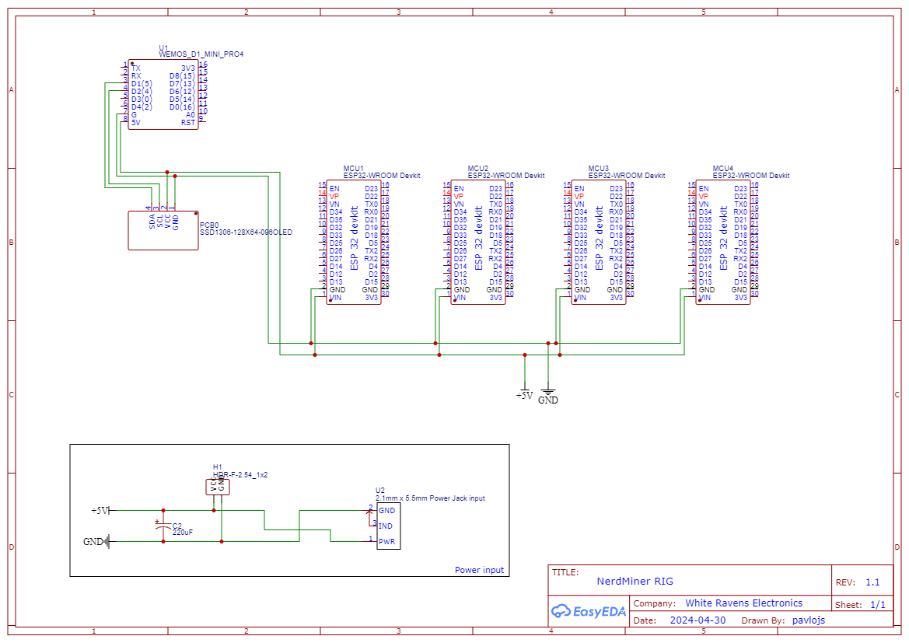
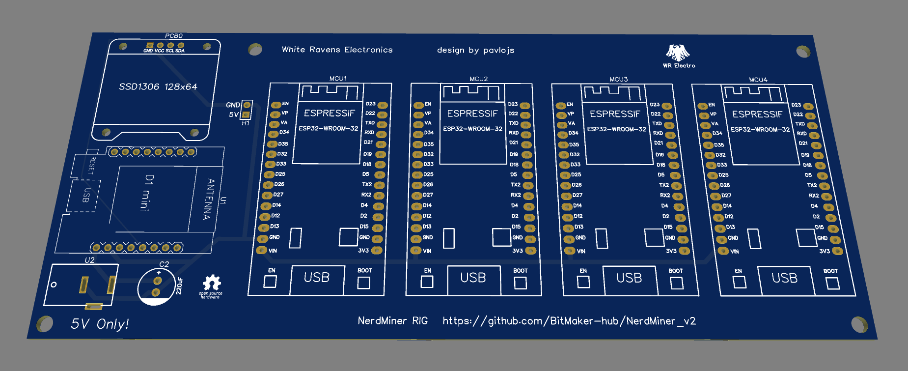

# NerdMiner RIG

**The NerdSoloMiner v2**

I designed a dedicated PCB to serve as a mining RIG for up to 4 ESP boards running the NerdMiner v2 software. No fancy display this time (but still eye-catching). An ESP8266 controls an OLED display that shows the current mining pool status, date & time, and your account statistics.

This project assumes some familiarity with the Arduino IDE, basic electronics, and is designed to help save space for your miners (more performance, less bulk).

It is intended to work with the official NerdMiner pool site ([pool.nerdminers.org](https://pool.nerdminers.org/)), as the ESP8266 code is tailored to parse data from this pool’s API. You can omit the OLED display and ESP8266 entirely and use the “bare” PCB as a rig. On the other hand, you can stack multiple PCBs together, using the 5V and GND pins, to save even more space.

## Requirements

### Hardware

- PCB  
- ESP32-WROOM-32, ESP32-DevKit1 (30-pin board)  
- ESP8266 D1 Mini  
- 0.96-inch OLED SSD1306 Display I2C 128×64  
- Electrolytic capacitor 220µF  
- Barrel jack connector  
- 5V power adapter (minimum 2A recommended; more if multiple PCBs are used)  

You can also power your RIG with a micro-USB cable connected to the ESP8266 instead of using the barrel jack connector.

### Schematics



### Software

- [Arduino IDE 2.0](https://www.arduino.cc/en/software)  
- [NM2 online flasher](https://flasher.bitronics.store/)  

## Build



- Download the Gerber files and use a PCB manufacturer of your choice.  
- A super-simple acrylic “case” is also available if you want a nice desktop stand.  
- Solder all components in place, following the schematic and PCB markings.  
- Flash the NerdMiner firmware on each ESP32 using the [microMiners Flashtool](https://github.com/BitMaker-hub/NerdMiner_v2?tab=readme-ov-file#microminers-flashtool-recommended).  
- *Note: You need to use firmware **NMV2 1.6.3 on ESP32-WROOM***.  

#### Code configuration

Copy this repo or download the latest release.  

Rename ```secrets.example``` to ```secrets.h```. Then open the project (```main.ino```) in Arduino IDE. Inside the secrets file, add your Wi-Fi credentials, set up a time zone, and enter your BTC wallet address.  

#### Programming

In Arduino IDE, install ESP8266 board support via Boards Manager and download the required libraries. Then select your ESP8266 board before uploading the code.

1. Open **Arduino IDE → File → Preferences** and add this URL to *Additional Boards Manager URLs*:
```http://arduino.esp8266.com/stable/package_esp8266com_index.json```

2. Go to **Tools → Board → Boards Manager**, search for *ESP8266* and click *Install*.  

3. Select your board under **Tools → Board → ESP8266 Boards (D1 Mini clone)**.  

4. Install the required libraries via **Sketch → Include Library → Manage Libraries**.  

5. Connect the board by USB, select the correct Port, and upload the code.